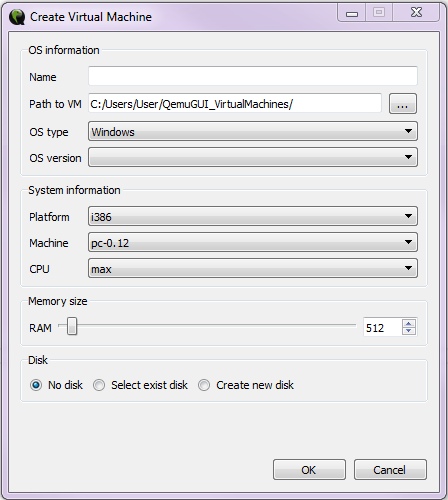
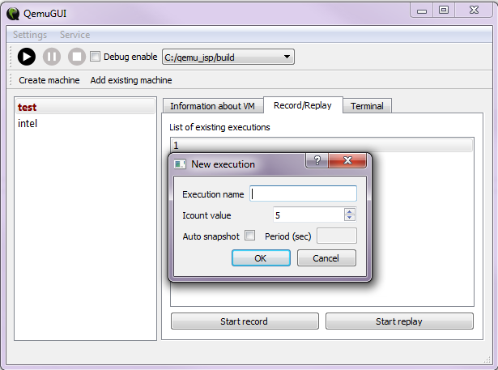

Before work with qemu-gui you have to add qemu installation folders. You can do it by two ways: 
1. Use combobox "Add qemu"
2. Use menu "Settings" -> "Set QEMU"

Is necessary to choose folder with executable qemu files (qemu-system-*).

### Create virtual machine

To create VM use button "Create machine". No has sense do it before adding qemu folders, because fields "Platform", "Machine" and "CPU" fill automatically during it.

The window "Create Virtual Machine" contains four parameters group: 
- "OS information"

    Is necessary to fill field "Name" and if you want you can change default path to VM.
    
    Fields "OS type" and "OS version" don't use now.
- "System information"

    Values of this fields had got from current qemu, you have to choose what you need.
- "Memory size"
- "Disk"
    - No disk
    - Select exist disk
    - Create new disk

 
    
### Edit VM settings

Available devices present as a tree in the left on the form. Right click on nodes let you add new devices.

Some devices have a set of options, which you can change. It include select values from lists, set values, add additional options to command line.

There is a line for additional command line common qemu parameters on the bottom, if is necessary set specific options.

 

#### Specific command line options example

Enable logfiles

`
-D logfile -d in_asm
`

Use specific boot option

`
-kernel kernel-qemu-4.4.34-jessie
`

If you make changes, all record/replay execution will be deleted, because set of devices influence on executions and they will not work.

### Record/Replay

Qemu-gui allows record executions and replay it. Execution is a scenario of work system inside qemu. Execution includes all user and network interaction, interrupts, timers and other. You can replay one scenario many times and make analysis if you need.

All existing executions for VM are showing on the tab "Record/Replay".

Execution may be replayed only from the qemu with which it was recorded.

You can set icount value and enable/disable autosnapshot function. Autospapshot needs value of period in second.

 

### Other

If you need to use debugger, is necessary set checkbox "Debug enable". After that, the debugger should be running and connect to the simulator:

`gdb -ex 'target remote :1234'`

[You can read more about debugging](https://github.com/ispras/swat/blob/master/docs/ReverseDebugging.md)
